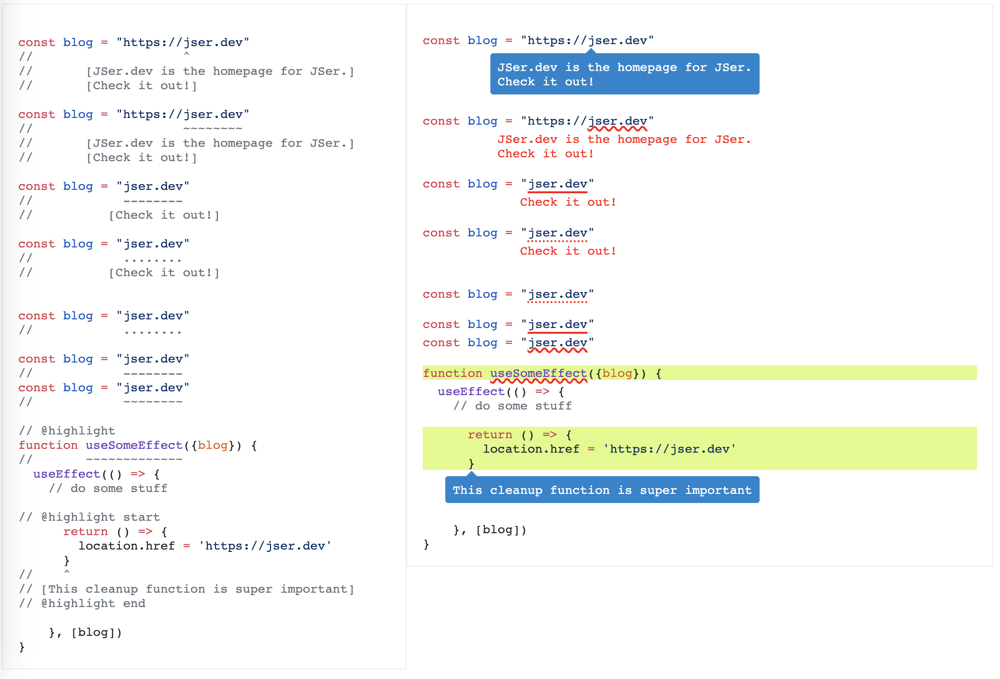

# shaku-code-annotate

<ruby>釈<rp>(<rp><rt>Shaku</rt><rp>)<rp></ruby>- _elucidate, explain_

This module enables you to annotate your code snippet with separation from normal comments,
makes it easier to explain the code. It uses [shiki](https://github.com/shikijs/shiki) as backbone and inspired by [shiki-twoslash](https://shikijs.github.io/twoslash/).

Take a look at the live demo from

1. [Shaku playground](https://shaku-web.vercel.app)
2. [demo with Astro](https://stackblitz.com/edit/github-yunziv?file=src%2Fcontent%2Fblog%2Fshaku.mdx).
3. [demo with Next.js](https://stackblitz.com/edit/github-hrpoqm-zfq1kt?file=pages%2Findex.mdx).

## Usage

You should choose the right plugin for your code base.

1. [remark-shaku-code-annotate](../remark-shaku-code-annotate/)
2. marked? TODO
